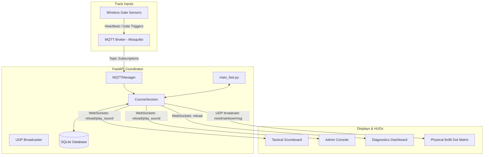

# UK R2D2 Builders - Droid Driving Course Controller (V2)

An event-ready, production-grade automated scoreboard and control system for the UK R2-D2 Builders driving course. This system interfaces with wireless track sensors, local displays, administrative interfaces, and physical dot matrix timers.

---

## 🏗️ System Architecture
The application runs as a central event hub on a Raspberry Pi or coordinator PC:



---

## 🚀 Key Features

*   **Tactical Scoreboard:** High-density, auto-scaling leaderboard HUD showing driver identity, active timers, penalties, and live podium rankings.
*   **Neutral Contender System:** Granular "Manual Entry" blocks for walk-in drivers (no portal account needed) with automatic database containment to protect official portals from data clutter.
*   **In-Memory Practice Runs:** Supports active practice runs without any drivers registered. The HUD lights up in real-time but doesn't write results to the database disk.
*   **Live Course Mode Scanning:** Scans the `./course/` directory to discover and toggle racing profiles (e.g., Figure-8) on the fly.
*   **MQTT Telemetry Panel:** Live tracking of track sensor vitals (IP address, signal RSSI strength, battery voltage levels, and offline/online times) on the diagnostics panel.
*   **HTML5 Browser Audio Fallback:** Seamless fallback that plays sound effects (air horns, fail beeps, top-run sirens) directly through the browser speakers of connected displays if the server lacks native Pygame audio support.
*   **Network Connection Monitors:** Live heartbeat trackers on HUD pages showing visual indicators if they lose connection to the FastAPI server (`Uplink Offline`) or if the server loses connection to the MQTT broker (`MQTT Offline`).

---

## 🛠️ Installation & Running

### 1. Environment Setup
Install the necessary system dependencies, then run the environment script to create the Python virtual environment and install pip requirements:

```bash
# Set up virtual environment and dependencies
chmod +x setup_env.sh
./setup_env.sh
```

### 2. Running the Server
Activate the virtual environment and start the FastAPI uvicorn server:

```bash
source venv/bin/activate
python3 main_fast.py
```

Open your browser and navigate to:
*   **Dashboard/Menu:** `http://localhost:8000/`
*   **Scoreboard Display:** `http://localhost:8000/scoreboard`
*   **Admin Console:** `http://localhost:8000/admin`
*   **Diagnostics Panel:** `http://localhost:8000/diagnostics`

---

## 📡 API & Hardware Protocols

### 1. UDP Broadcast Commands (Port `8888`)
The controller broadcasts standard timing control sequences to physical hardware:
*   `reset`: Forces track display screens and gates to revert to standby state.
*   `rainbow`: Activates rainbow-glow success lights for a new leaderboard record.
*   `msg:<message>`: Sends text directly to the 8x96 Dot Matrix device.
    *   *Idle / Practice:* Displays `Practice Run`
    *   *Official Contender:* Displays `<Firstname> & <Droid>` (e.g. `Darren & R2-DJP`)
    *   *Top Run:* Displays `TOP RUN!`
    *   *Slow Finish:* Displays `SLOW RUN`
    *   *Pinball Finish:* Displays `PINBALL DROID`

### 2. MQTT Sensor Topics (`droid_course/#`)
Sensors communicate back to the coordinator using the following topics:
*   `droid_course/sensor_id/heartbeat`: Publishes JSON containing metadata:
    ```json
    { "ip": "192.168.6.101", "rssi": -65, "battery": 3.70, "version": "2.0.0", "type": "bump" }
    ```
*   `droid_course/sensor_id/gate`: Trigger events:
    *   `{"value": "FAIL"}`: Sensor beam broken.
    *   `{"value": "PASS"}`: Successful checkpoint cross.
*   `droid_course/sensor_id/run`: Run control triggers (e.g. from physical timers).

---

## 💾 Firmware Development & OTA Upgrades
The project is configured for building and updating sensor nodes wirelessly (OTA) using **PlatformIO**.

### 1. PlatformIO Project Layout
PlatformIO configurations are available for:
*   [Arduino/Bump_Sensor/platformio.ini](file:///home/daz/Source/r2_builders/droid_driving_course/Arduino/Bump_Sensor/platformio.ini): ESP8266-based D1 Mini bump sensors.
*   [Arduino/Timer/platformio.ini](file:///home/daz/Source/r2_builders/droid_driving_course/Arduino/Timer/platformio.ini): ESP32-based WeMos Uno32 timer devices.

Both firmware environments are configured to compile `.ino` source files directly in their directories (`src_dir = .`) for dual-compatibility with the Arduino IDE.

### 2. Manual OTA Uploads
To flash a specific connected device via WiFi, configure your target IP address as the upload port in PlatformIO:

```bash
# Upload Bump Sensor firmware via OTA
pio run -d Arduino/Bump_Sensor -t upload --upload-port 192.168.6.101
```

### 3. Dashboard Web Updates
The **Diagnostics Dashboard** (`/diagnostics`) actively tracks connected nodes:
*   If a sensor reports a version check lower than the coordinator's target version (`2.0.0`), a flashing amber **UPGRADE** button appears next to its name.
*   Clicking **UPGRADE** triggers a non-blocking background job on the server.
*   The coordinator automatically compiles the target binary using PlatformIO and pushes it wirelessly over the network via the `espota` protocol. Compilation and upload status is written in real-time to the diagnostics event logger.
