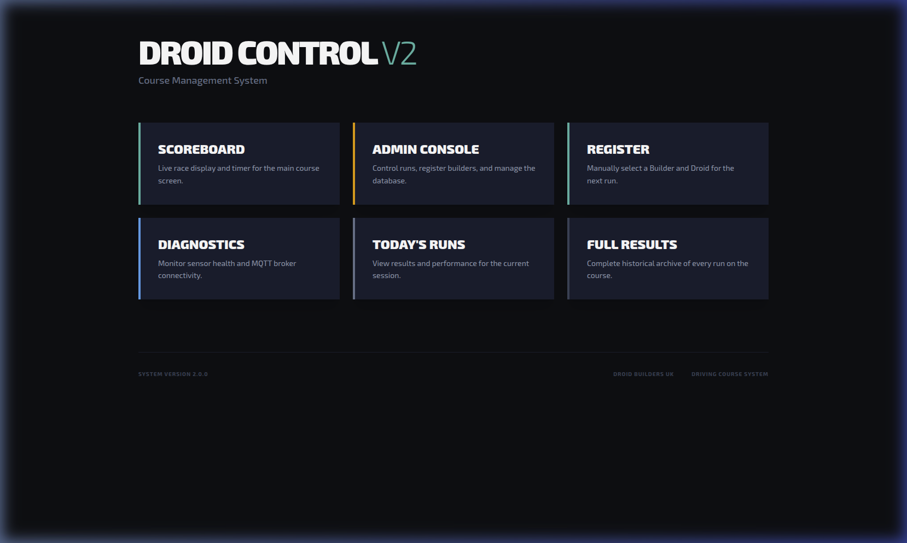
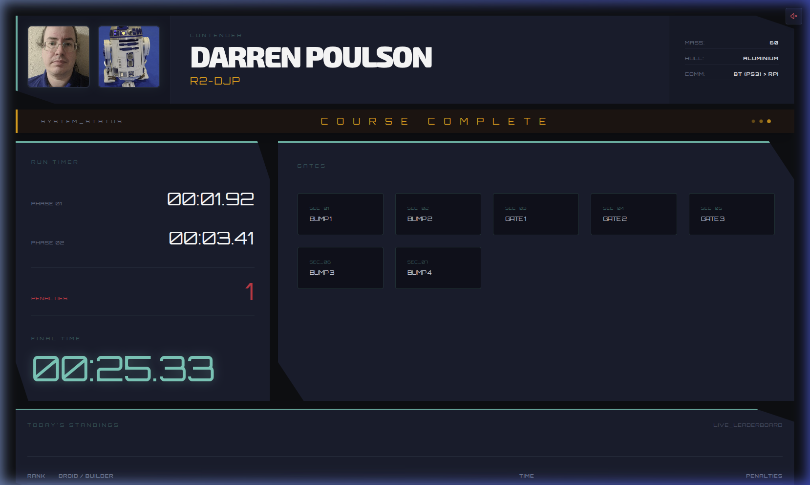
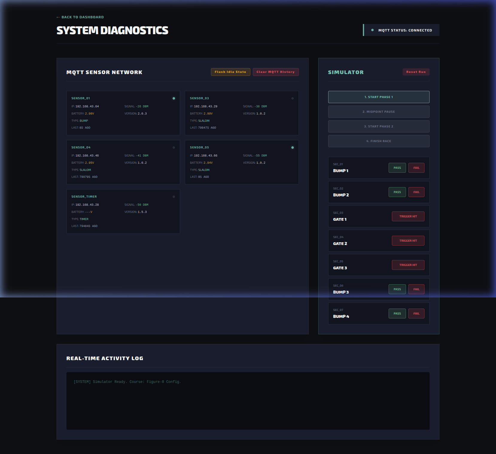
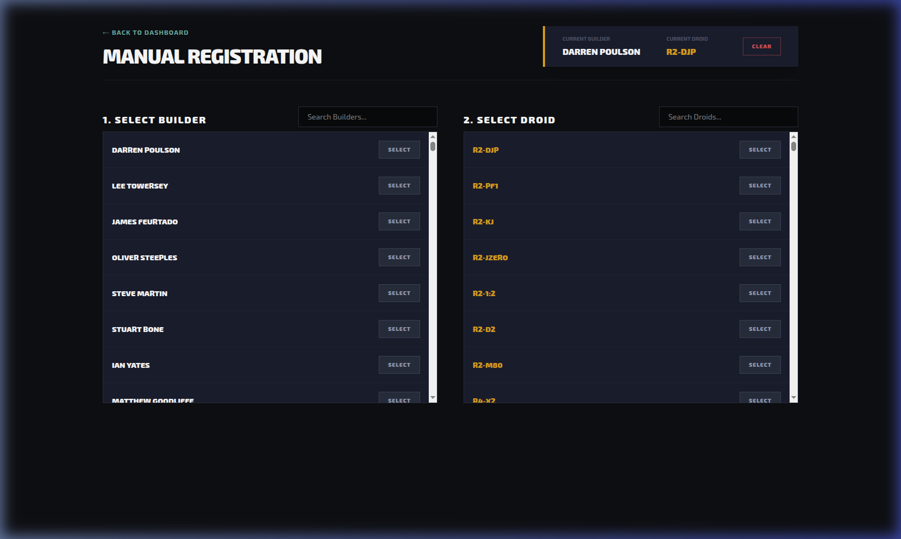
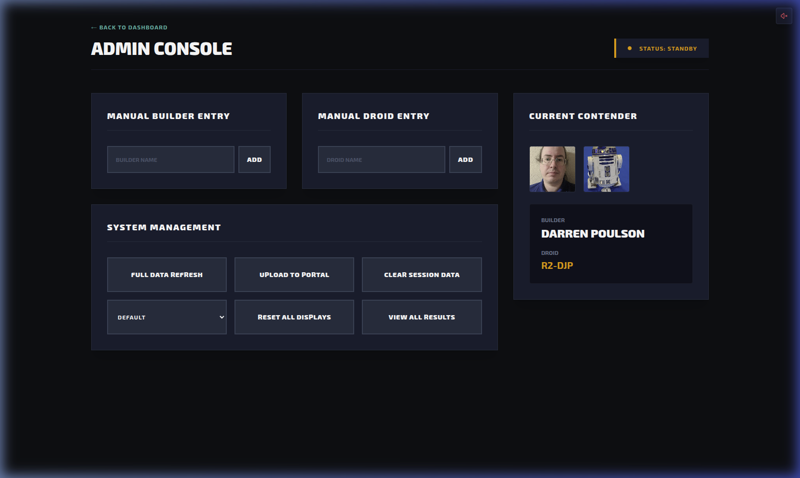

# 🤖 UK R2-D2 Builders - Droid Driving Course
## Official Event Operator Manual & Handbook

This guide contains everything you need to set up, test, operate, and shut down the automated timing and scoring system for the R2-D2 Droid Driving Course at an event.

No programming or electronics background is required to run this system. Follow the step-by-step instructions below.

---

## 📋 Quick Reference Navigation
* [1. Overview - What It All Is](#1-overview---what-it-all-is)
* [2. Setup & Boot Order](#2-setup--boot-order)
* [3. Running a Driving Session](#3-running-a-driving-session)
* [4. Overnight Shutdown & Charging](#4-overnight-shutdown--charging)
* [5. Technical Reference - Firmware, OTA & MQTT Protocols](05-technical-firmware-mqtt.md)

---

## 1. Overview - What It All Is

The Droid Driving Course Controller is an automated timing, scoring, and sound system. It tracks droids driving through the obstacle course, detects penalty hits via wireless sensors, calculates final times, and broadcasts live rankings onto display screens.

### System Components

| Component | Description | Power Source / Role |
| :--- | :--- | :--- |
| **Central Coordinator ("Pi Brain")** | Main Raspberry Pi running web server, Wi-Fi AP (`r2course`), MQTT, and audio. | USB-C Power Adapter. Placed near control desk. |
| **Display Screens (Pi Zeros)** | Raspberry Pi Zeros driving monitors or projectors via HDMI. | Micro-USB/USB-C power. Facing spectators. |
| **Wireless Bump & Slalom Sensors** | Bumper blocks with micro-switches and ESP8266 Wi-Fi transmitters. | External single-cell USB Power Banks. Placed on course borders. |
| **Timer Display & Gates** | 5-digit LED matrix display and optical IR beam break sensors. | 5V 5A Mains Power Supply. Positioned at start/finish lines. |
| **Operator Tablet / Laptop** | Phone, iPad, or laptop connected to `r2course` Wi-Fi. | Battery / Operator desk. Used by event staff. |

### Web Interfaces Available
When connected to the course Wi-Fi network, open a web browser and go to `http://192.168.43.1:8000/` (or `http://192.168.6.76:8000/` depending on local router IP) to access:

* **`/scoreboard` — Tactical Scoreboard HUD**: Displays live timers, active driver, podium rankings, and penalties for spectators.
* **`/admin` — Admin Control Console**: Used by event staff to select drivers, start/stop timers, and assign penalties.
* **`/diagnostics` — Diagnostics Panel**: Shows wireless sensor battery levels, Wi-Fi signal strength, and live event logs.
* **`/contenders` — Contender Registration**: Search for registered builders and assign droids to active runs.

---

## 2. Setup & Boot Order

> [!IMPORTANT]
> **Boot order is critical!** The central "Pi Brain" MUST be fully powered on before turning on sensors or display screens so they can find the Wi-Fi network.

### Step 1: Power On the Central "Pi Brain" (FIRST!)
1. Plug the main Raspberry Pi Coordinator into a wall power outlet using its official USB-C power adapter.
2. Wait **2 minutes** for the Pi Brain to boot up, start its internal Wi-Fi network (`r2course`), and initialize the timing software.
3. Check your phone or laptop Wi-Fi settings to confirm the `r2course` Wi-Fi network is visible.

### Step 2: Power On Display Screens (Pi Zeros)
1. Ensure HDMI cables are connected from the Raspberry Pi Zeros to your monitors, TVs, or projectors.
2. Turn on the monitors.
3. Plug power micro-USB/USB-C cables into each Raspberry Pi Zero.
4. The Pi Zeros will automatically boot directly into full-screen Kiosk mode and display the **Tactical Scoreboard HUD**:

### Step 3: Power On Track Sensors & Timer Display
1. **Bump & Slalom Sensors**: Plug a charged USB power bank into each sensor module.
2. **Timer Display & Gates**: Plug the 5V 5A power supply into wall power and connect it to the main Timer Board.
3. **Observe Wi-Fi Connection Patterns**:
   * While connecting to `r2course` Wi-Fi, sensor LEDs pulse red.
   * **Connected (Rainbow Flash)**: Upon successful Wi-Fi connection, **all sensors and the big 5-digit Timer Clock flash a vibrant rainbow light pattern**! The LED matrix under the timer board displays Wi-Fi connection status.

### Step 4: Testing & Verifying Sensors
Before opening the course to droids, verify that all sensors are online and working:

1. Connect your tablet/laptop to the `r2course` Wi-Fi network.
2. Open the web browser and go to **`http://192.168.43.1:8000/diagnostics`**:

3. **Check Sensor Statuses**:
   * Confirm that every sensor shows a green **ONLINE** status.
   * Check battery voltages (must be above **3.5V** for full event operation).
4. **Physical Walkthrough Test**:
   * Tap each **Bump Sensor** micro-switch by hand. You should hear a fail sound/horn from the speakers, and a new event entry will appear in the **Live Event Logger** on the Diagnostics page.
   * Walk through each **Timer Gate** to break the beam. Verify that the trigger registers on the Diagnostics screen.

---

## 3. Running a Driving Session

### Step 1: Registering / Selecting a Contender
Open the **Admin Console** (`/admin`) or **Contender Registration** (`/contenders`):

1. Search for the builder's name or droid name in the database.
2. Click **SELECT** next to their profile to load them into the active driver slot.
3. *For walk-in drivers without a pre-registered account*: Click **ADD MANUAL CONTENDER** to quickly register a temporary builder name and droid.

### Step 2: Operating the Admin Control Console
Open the **Admin Console** (`/admin`):

1. **Start the Run**:
   * Have the droid line up at the start line.
   * Click the green **START RUN** button (or let the droid trip the optical Start Gate automatically).
   * The live timer will start ticking on the Scoreboard HUD screens, and start audio will play.

2. **Managing Hits & Penalties**:
   * If a droid hits a wall or obstacle with a **Bump Sensor**, the system automatically adds a penalty (+20 seconds) and plays a failure sound effect.
   * If an obstacle has no electronic sensor, event staff can click **+1 PENALTY** on the Admin Console manually.

3. **Finishing the Run**:
   * When the droid crosses the finish line, click **FINISH RUN** (or let the Finish Gate trip).
   * The final run time (Clock Time + Penalties) is calculated and saved to the database.
   * The **Scoreboard HUD** updates instantly to show the driver's final score and podium standing!

---

## 4. Overnight Shutdown & Charging

At the end of the event day, follow these steps to safely power down equipment and charge batteries.

### Step 1: Equipment Shutdown Sequence
1. **Disconnect Track Sensors**: Unplug USB power banks from all Bump and Slalom sensors. Unplug the 5V 5A power supply for the Timer Display Board & Gates.
2. **Shut Down Display Pi Zeros**: Unplug power from the Raspberry Pi Zeros and turn off screens.
3. **Shut Down Central Pi Brain**: On the Admin Console (`/admin`), click **Shutdown Server (Raspberry Pi)** (or run `sudo shutdown -h now` from terminal) before disconnecting main power.

### Step 2: Power Bank Care & Nightly Charging
1. Plug all USB power banks into multi-port USB chargers provided in the support kit.
2. Verify that charging LEDs on power banks light up.
3. Leave power banks charging in a safe, well-ventilated location overnight.

### Step 3: Storage
1. Store sensor modules, USB power banks, and cabling in protective storage totes.
